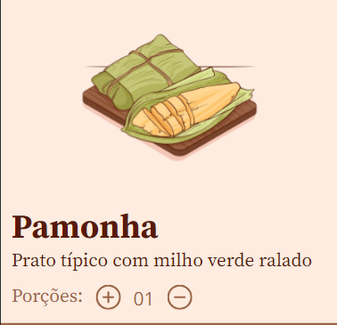

<h1 align="center">Receita Junina</h1>

   
  

## 🌞 Tecnologias

- HTML e CSS
- JavaScript
- Git e Github
- Figma
   

## 🧵 Projeto

O projeto se baseia em uma receita de pamonha, podendo adicionar ou reduzir as porções que você deseja cozinhar, com quantias dinâmicas!
 

## 🔖 Layout

O layout genérico do projeto está disponível [Nesse link](https://www.figma.com/community/file/1255887923488942888). É necessário ter conta no [Figma](https://figma.com) para acessá-lo.
